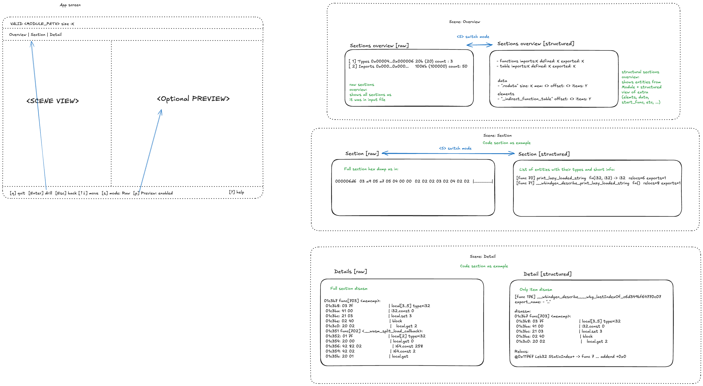

# Inspect WASM modules in more fancy way.

Modern WASM app can't be handled like isolated wasm module acording WASM spec. They are built with LLVM and combine multiple layers that need to live together. WASM specific entities (like functions, tags, memories, globals, ...), data and element segments, linker specific (data symbols, symbol table, relocations) dylink spec(dylink0) and component specific sections.

During developing wasm transformation libraries, codegen, or other low-level tool - structural representation is crucial and helps debugging huge array of problems (like incorrect relocations, wrong entity ids, import/defined messup, and so on).

There multiple tools that helps debug and visualise Web Assembly module.
WABT has `wasm-validate` and `wasm-objdump` bytecodealiance provide `wasm-tools` with similar functionlity.
But all that tooling is very limited in representing structural information linking between different sections/entities and reporting errors:

- validators shows only offset and short errors (without visual representation of context that caused this error), even when structural information already available (during fn parsing);
- `wasm-objdump` doesn't help with debugging cross-entities linkage (no way to follow calls, relocs, etc. );
- linkage symbols is supported but in limited way;
- relocations list is not well-formated;
- no support of dylink0 section (from loader perspective);

`wamex-object` is a library that places structural information at first place (type level indexes, builder helps one that build modue to not mess with numbers) and handle duality of WASM representations (from perspective of WASM spec and linker), it can be used as building brick for code transformation libraries, and other wasm related tooling. It also contains a lot of helpers for debug representation of inner wasm module (like hexdump, relocs formating, etc..). So `wamex-inspect` is a try to extract this functionality in a small reusable TUI aplication, linke `wasm-objdump` + `wasm-validate` but interactive and with better support of extensions linkage, dylink, and later component model.

## LLM usage

While usage of LLM in `wamex-object` is not recommended (due to novelity of architecture, and constant desire of LLMs to duplicate code), in `wamex-inspect` 80% starting code was implement using various of LLMs based on design drawing in: 

